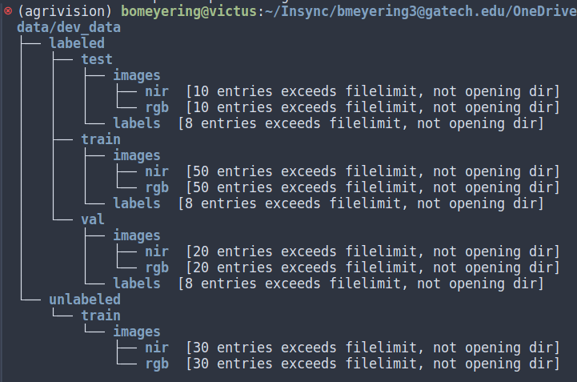

# OMSA-CS7643-AgriVision
## Project Summary
This is our group project repository for CS 7643 - Deep Learning at Georgia Tech. The main focus of this project is to develop several semantic segmentation models for an agricultural field image dataset using different semi-supervised deep learning techniques such as self training and co-training in order to better predict the test set over 9 different semantic classes.

The datasets used for this project come from [Agriculture Vision](https://www.agriculture-vision.com/). The first dataset, published in 2021, is fully labeled and comes prepartitioned into training, validation, and holdout test sets. Each image has RGB and NIR channels and is precropped to a dimension of 512x512. It has masks for each of the annotated classes in the list below.
* 0 - background
* 1 - double_plant
* 2 - drydown
* 3 - endrow
* 4 - nutrient_deficiency
* 5 - planter_skip
* 6 - water
* 7 - waterway
* 8 - weed_cluster

Additionally, we will use a new dataset published for the 2024 [Agriculture Vision challenge](https://www.agriculture-vision.com/agriculture-vision-2024/prize-challenge-2024). This includes 206, 32bit tiff files for the RGB-NIR channels but the size of the images are all around ~9000x9000 and are unnormalized. None of theses new images are labeled, and thus using a semi-supervised training scheme, we aim to push the limits of training a new segmentation model and evaluate it on the test set.

## Data Download
1. Clone this repo into your local machine.
```
$ git clone https://github.com/francislin96/OMSA-CS7643-AgriVision.git
```
2. Download the 2021 Agriculture Vision Dataset. Make sure that you have [AWS CLI](https://docs.aws.amazon.com/cli/latest/userguide/getting-started-install.html) installed on your machine. Extract the `tar.gz` file and copy the contents directly to `./data/images_2021`
```
$ aws s3 cp s3://intelinair-data-releases/agriculture-vision/cvpr_challenge_2021/supervised ./data/supervised --no-sign-request --recursive
$ tar -xzf ./data/supervised/Agriculture-Vision-2021.tar.gz
$ cp -r ./data/supervised/Agriculture-Vision-2021/* ./data/images_2021/
$ rm -rf ./data/supervised/Agriculture-Vision-2021/
```
3. Download the 2024 unlabeled Agriculture Vision Dataset. Agriculture Vision has it stored in DropBox for the time being so download the zipped file [here](https://www.dropbox.com/scl/fo/7yzzc8hqtvaki2y1md6h4/h?rlkey=su71dij6xfb964zfwe1d6kros&dl=0). Copy it into `./data/`, unzip, and move the contents into `./data/images_2024`
```
$ cp PATH_TO_DOWNLOAD_ZIP_HERE ./data/images_2024/
$ unzip ./data/images_2024
$ rm ./data/images_2024
```

## Environment Setup
1. Set up a virtual environment using the environment manager of your choice. I like using `pyenv` with `virtualenv` to easily manage Python versions and environments. Create a new environment, and set it in the root directory.
```
$ pyenv virtualenv 3.11.8 ENVIRONMENT_NAME
$ pyenv local ENVIRONMENT_NAME
```
2. Install all of the dependencies.
```
$ pip install -r requirements.txt
```

## Model Weights
Once we train a model, have the ability to download weights from AWS, Zenodo, or something like that. They will be too large to host on GitHub...
```
$ wget URL_TO_WEIGHTS.pth
```

## Inference Code or Django App Deployment
Use this section to explain how to run inference scripts and/or stand up the Django application. We can always try to have this deployed in a AWS Sagemaker serverless instance for easy inference but that might be overkill...

## Train Model (Under development)
Set your config file using the example in `./config/dev_config.yaml` as an example

Make sure your images and masks are in the same format as shown in the dummy dev_data set in `data/dev_data`


Pull the latest commit from branch `fixmatch_dev` to get the dev_data

In the root directory run 
```
python test_main.py ./config/dev_config.yaml
```

You should see a training progress bar and the loss decreasing slightly, not bad for completely random images lol!

TO DO:
* The loss for the labeled images is straightforward cross entropy loss where we take the mean value of CE for a given image from the formula $H(p_b, p_m(y | \alpha(x_b))$ where $p_b$ is the true label distribution, and $p_m(y | \alpha(x_b))$ are the pixelwise class probabilities output from the models predictions on weakly augmented images $\alpha(x_b)$.
  
  $l_s=\frac{1}{B} sum H(p_b, p_m(y | \alpha(x_b))$

  We should implement this vanilla version and then make the class balanced focal loss version on top of it
  
* The loss for the unlabled images just makes some minor modifications on the cross entropy. The cross entropy term is calculated using the pseudo labels $\hat{q}_b$ and the softmax predictions from the strongly augmented images $p_m(y | \mathcal{A} (u_b))$. These pixelwise losses are masked based on a hyperparameter $\tau \in \[0, 1\]$ that sets the condfidence level below which to discard the predictions using the max softmax predictions $q_b$ using $\mathbb{1} max(q_b \geq \tau)$. The mean is taken over all of these losses and the $B$ batch term is scaled by the hyperparameter $\mu$.

 $l_u = \frac{1}{\micro B} \sum \mathbb{1} max(q_b \geq \tau) H (\hat{q}_b, p_m(y | \mathcal{A} (u_b)))$

Both $\tau$ and $\mu$ are set in the config file as `mu` and `tau` hyperparameters. Both $l_S$ and $l_u$ are combined to form $l_{total}$ weighting the unlabeled loss like 

$l_{total} = l_s + \lambda l_u$ where lambda is the weighting factor for the unlabeled loss term set in the config as `lambda`

This is currently configured correctly in the code, and we shouldn't apply any class balancing to this loss term since we don't know the actual distributions of the labels in the unlabeled 2024 image data set. The scaling factor is currently set to 1 in the dev_config.yaml file and I haven't explored any hyperparameter tunining with that yet.

* I have not switched on the normalization augmentation for the transformations in `src/utils/transforms.py` since we don't have the NIR channel means and std yet. Once we have them, they need to go in `data/dataset_maps.py` and then push the changes.
* No validation loop is set up yet (in the works...)
* We don't have any of the `torchmetrics` set up yet either. These are going to be really easy to implement. I would suggest starting a `metric.Collection` in `src/metrics.py` [torchmetrics](https://lightning.ai/docs/torchmetrics/stable/)
* Implement some unit tests and integration tests!!! I've been lazy and added random sanity checks to the root directory such as `test_main.py`and `test_loaders.py` but these should be refactored and put in the proper `./tests/...` directory.
* Something else I'm missing...
